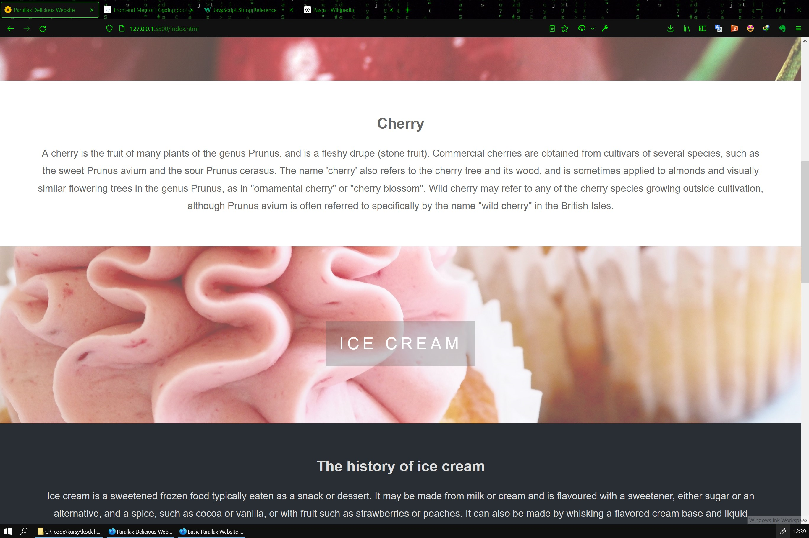

# Basic Website With HTML & CSS

[Source code](https://github.com/chriskodehub/KH-10_basic-website-with-html-css)  
[Live demo](https://chriskodehub.github.io/KH-10_basic-website-with-html-css/)

## Oppgave

https://www.youtube.com/watch?v=JttTcnidSdQ

Basic  scroll effect Website With HTML & CSS
EX: Make a website about your favourite country/food/travel/ any topic  using this video as reference.

## Resources

1. [Free pictures]()

## Result

